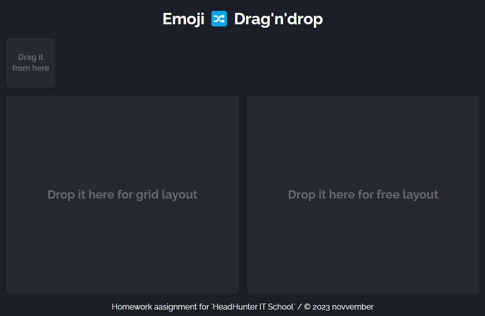

# Домашнее задание для "Школы программистов HeadHunter" (JS/AJAX 2)

## 👀 Демо

[`novvember.github.io/hh-drag-n-drop`](http://novvember.github.io/hh-drag-n-drop)



## Что сделал + стек

- верстка: семантическая, адаптивная, БЭМ
- шрифт подключен через Google Fonts
- вместо цветных квадратов генерируются рандомные эмоджи
- перемещение работает как мышкой, так и с тачем (использованы события Pointer events)
- всё управление drag'n'drop вынесено в отдельный класс DragNDrop:
  - добавление слушателей события на элемент
  - пермещение элемента при движении указателя
  - определение, находится ли перемещаемый объект над нужными элементами (по положению курсора/указателя относительно границ зоны)
  - расчет координат объекта относительно нижних элементов
  - обработка "отпускания" элемента: очистка навешенных временных свойств и слушателей и вызов колбека
- в основном файле `index.js` всё остальное:
  - константы (элементы, селекторы, имена классов)
  - создание элемента с рандомным эмоджи
  - эффекты наведения элемента на зоны
  - обработчики добавления элемента в каждую из зон
  - основной стартовй обработчик зоны, создающий новые объекты
- логика добавления в зону с "сеткой":
  - элемент добавляется в элемент-контейнер в конец (`position: static`)
- логика добавления в зону со "свободной" расстановкой:
  - элемент добавляется в контейнер и получает абсолютное позиционирование относительно контейнера
  - чтобы не захламлять страницу вне зоны принял решение немного корректировать положение тех элементов, которые не полностью попадают в зону: они сдвигаются внутрь зоны

## Возникшие проблемы

1. При переходе с Mouse events на Pointer events не все получилось:

- Перетаскивание по собитию `pointermove` плохо или почти совсем не работает на мобильных. Судя по информации в интернете, это связано со встроенными в браузер собственными обработчиками тач-событий. В css отключил такие события через `touch-action: none`, но из-за этого теперь на таче не работает скролл (если страница достаточно длинная).

- Не срабатывал нормально обработчик на `pointerup`. Решил проблему добавлением его не на перетаскиваемый элемент, а на document.

2. Хотел для отслеживания элементов под перетаскиваемым использовать IntersectionObserver, однако получилось, что детектит пересечение только при отпускании кнопки мышки (а мне хотелось подсвечивать области, если сюда можно отпустить элемент). Сейчас применил, наверное, не очень хороший вариант.

3. В первоначальном варианте у меня была задана минимальная высота всего контейнара страницы (`min-height: 100vh` или `height: 100vh`). Но в таком случае зоны растягиваются по высоте и неверно определяются коорднаты: например, если во вторую зону добавить элемент в самый низ, то он будет сдвинут на слишком большое расстояние. Не смог выяснить, почему так происходит. Можно было выключить коррекцию позиции элемента при добавлении, но пока решил просто убрать растягивание интерфейса по высоте.

## Что можно улучшить

- возможность перетаскивать элементы и после первого взаимодействия (например, перетащить из первой зоны во вторую)
- автогенерация нового элемента не при захвате указателем, как сейчас, а при наведении мышки либо чтобы элементы сами генерировались через определенный временной интервал и сменяли друг друга

## Задание

Реализовать drag’n’drop элементов с помощью курсора мыши, либо касанием пальца на тач-устройстве

- Зона создающая новый элемент при перетаскивании
- Элемент — квадрат 100х100px случайного цвета
- Область при перетаскивании в которую элементы располагаются в соответствии с сеткой
- Область сохраняющая положение перемещенного в неё элемента
- Если элемент опущен мимо вышеописанных областей — он исчезает

```
:::::::::::::::
::Здесь берем::
::::элемент::::
:::::::::::::::

:::::::::::::::::::     :::::::::::::::::::
:::::::::::::::::::     :::::::::::::::::::
:::Тут размещаем:::     :::Тут размещаем:::
::::::по сетке:::::     ::::::свободно:::::
:::::::::::::::::::     :::::::::::::::::::
:::::::::::::::::::     :::::::::::::::::::
```
